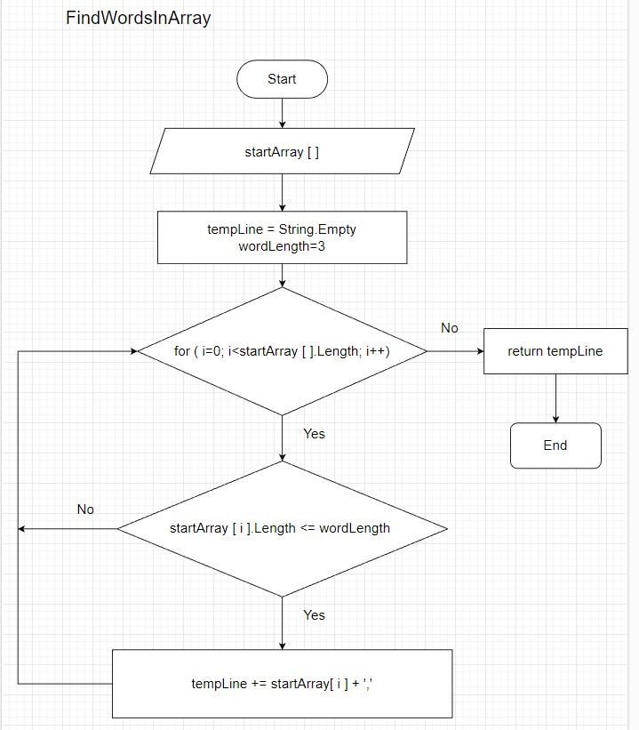

## Инструкция по программе

### Описание программы
Программа формирует из введенного массива строк другой массив из строк, длина которых меньше либо равна 3 символам. 

### Принцип работы тела программы
Пользователь первоначально вводит количество слов в исходном массиве. За количество слов отвечает переменная *wordsNumber*.

Далее пользователь вводит каждое слово в исходный массив *inputArray*. За ввод массива отвечает функция **inputArray**.

Затем происходит обработка исходного массива *inputArray* при помощи функции **FindWordsInArray**. Результат запишется в массив *resultArray*.

После этого выводим массив *resultArray* на экран. За вывод отвечает функция **printArray**.

### Принцип работы функции **FindWordsInArray**
В качестве аргумента функции передаются два массива:
* исходный массив строк в массив *startArray*. 
* массив для записи результата *endArray*, куда мы будем передавать слова с длиной меньше или равно 3 символов. 

Создается переменная *wordCounter*=0, которая будет считать количество слов в новом массиве  *endArray*. 

При помощи цикла For ( 0 < i < *startArray.length* ) перебираем все элементы  в исходном массиве *startArray*. Если длина элемента *startArray [ i ]*<= 3, то тогда копируем этот элемент в массив результата *endArray*, счетчик слов *wordCounter* увеличиваем на единицу.

<!-- Ниже приведена блок-схема  функции **FindWordsInArray**

 -->